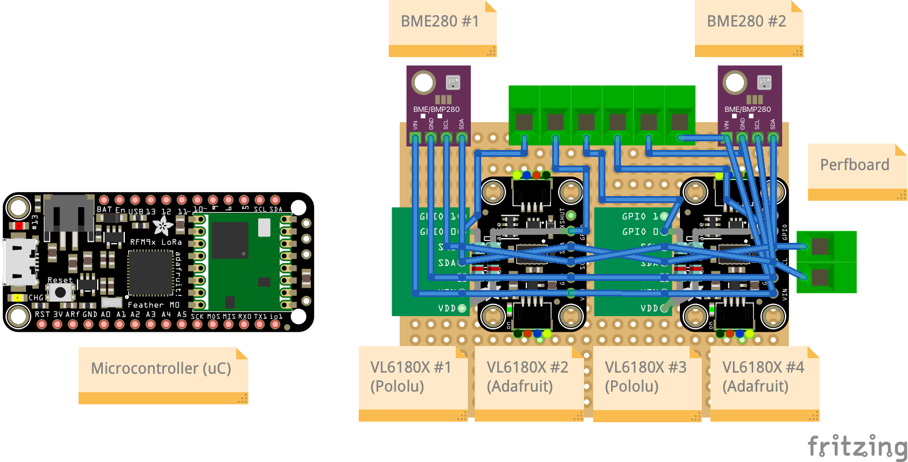

# ttn-ulm-crack-simulator-1377

Experimental setup to benchmark various _VL6180X_ distance sensors. The VL6180X by _STMicroelectronics_ is a time-of-flight (ToF) distance and ambient light (ALS) sensor. It measures the time a laser takes from the sensor to a reflecting target and back to the sensor. It has an optimal operating range from 0 - 10 mm with a resolution of 1 mm (up to 60 mm with decreased resolution) and an accuracy of +/- 1 mm. For more details, please refer to the [datasheet](https://www.st.com/en/imaging-and-photonics-solutions/vl6180x.html#documentation).

## Terms

The following terms are used in the course of this document:

| Term | Explanation |
| --- | --- |
| Sensor | A term that that is used for several different things. In the strict definition, it describes that piece of hardware that is capable of measuring something. A sensor can measure one or many information about its environment. In our case, the actual sensor is the VL6180X.  It can measures a distance between itself and a reflector or obstacle. Furthermore, it is capable of measuring its ambient light conditions. **BUT:** In its broader meaning (especially in the context of Arduino-like microcontrollers), sensor does not only describe that sensing piece of hardware, but also the package of required electrical components that the sensor is connected to. That package is actually called **breakout board** but can also be referred to as sensor. In the following, we will refer to the breakout boards as sensor. |
| Breakout Board | Package of several required electrical components and the actual sensor. Shipped by an integrator (e.g., Pololu and Adafruit) |
| Actual Distance | Real distance between reflector and sensor |
| Measured Distance | Distance between sensor and reflector as measured by a sensor (will vary)
| Sample error | Each sensor is different. Therefore, measuring the exact thing with two sensors of the same type will result in more or less different measurements. The delta is called sample error. |
| Microcontroller (uC) | Same as _sensor_. In the strict sense, uC describes a processing unit. But in the broader (our) sense, uC describes a uC mounted on a board along with several electrical components required for an easy experimentation in the context of Arduino and Co. |

## Goal

Since the speed of light in a medium depends on the density of that medium, the measured distance varies depending on the following environmental factors:

1. Ambient Light
1. Temperature
1. Relative Humidity
1. Air Pressure

Moreover, the measured distance will be affected by further parameters we now, such as ambient light or voltage drift of the power supply, but even worse, there are some factors, we have not considered. Consequently, we assume, that it is more goal-oriented to collect many measurements under different environment conditions but with the same actual distance to derive a mathematical model. The model to be developed should take the environmental factors as listed above as well as the ambient light and measured distance as inputs, and should return a distance that is as close as possible the actual distance.

### Notes

1. We exclude the effect of the reflectance of the reflector. Regarding the datasheet, we chose a light grey piece of aluminum.
1. We further exclude the effect of a varying voltage. In our experiment, we use a power supply (instead of a battery) that always ensures the same voltage.
1. To minimize the impact of a broken sensor or sample error, we use two BME280 and four VL6180X from two different integrators.
1. The VL6180X sensor offers an accuracy of +/-1 mm and a resolution of 1 mm. Nevertheless, we assume, that with a sufficient amount of measurements, the measured distance converges to the actual distance.

## Setup

All sensors are soldered to a perfboard which is mounted on top of a rail slider. The slider can be fixed at any position along the rail. The reflector is screwed at one side of the rail and can not be moved.

Sensors used and their sensing capabilities:

* 2x Pololu VL6180X (Distance, ambient light)
* 2x Adafruit VL6180X (distance, ambient light)
* 2x BME280 AliExpress (temperature, humidity, air pressure)

To start an experiment, the slider must be fixed to an arbitrary position.

## Program Flow

As it can be seen, the measurements are taken sequentially. In other words, in theory, there may be a variation in the environment conditions between the single measurements. However, since a single measurement of a VL6180X takes around 5 s (BME280 < 1 s), we assume, that this variation can be ignored.

### Measurement

In case of the VL6180X measurements (distance and ambient light), each value is calculated on the basis of a series of 50 single measurements. Based on these 50 single values, we calculate the mean, standard derivation, and median at the uC.

In case of the BME280 measurements (temperature, air pressure, humidity), the values are read a single time from the sensor and not further processed.

### Data Transmission

Due to packet size restrictions by the LMiC library (max 53 Byte / Packet), the measured data is sent separately per sensor. The packets are queued and sent after all measurements are taken. Consequently, the transmission does not delay the measurements.

The sent data packets are received by a server and stored in a database.

## Payload Format

Per measurement iteration (consisting of two BME280 measurements and four VL6180X measurements) the uC sends five packets: a packet containing environmental data and four packets containing distance data.

## Environment Packet

First packet sent by uC.

| Name | Unit | Description |
| --- | --- | --- |
| temp1 | °C | Temperature measured by BME280 #1 |
| pressure1 | hPa | Atmospheric pressure measured by BME280 #1 |
| humidity1 | % | Relative humidity measured by BME280 #1 |
| temp2 | °C | Temperature measured by BME280 #2 |
| pressure2 | hPa | Atmospheric pressure measured by BME280 #2 |
| humidity2 | % | Relative humidity measured by BME280 #2 |

## Distance and Ambient Light (ALS) Packet

There are four VL6180X ToF distance sensors connected to the uC. Two manufactured by Pololu (#1+2) and two by Adafruit (#3+4).

| Name | Unit | Description |
| --- | --- | --- |
| meanDistanceX | mm | Mean of 50 x distance measurements |
| standardDeviationDistanceX | mm | Standard deviation of 50 x distance measurements |
| medianDistanceX | mm | Median of 50 x distance measurements |
| successfulMeasurementsDistance | - | If a single measurement times out, it is excluded from the values above. Remainder: a series consists of 50 measurements. Hence, the max value is 50. If value is below 50, value might not be reliable. |
| meanAmbientLightX | ? | Mean of 50 x ALS measurements |
| standardDeviationAmbientLightX | ? | Standard deviation of 50 x ALS measurements |
| medianAmbientLightX | ? | Median of 50 x ALS measurements |
| successfulMeasurementsAmbientLightX | - | If a single measurement times out, it is excluded from the values above. Remainder: a series consists of 50 measurements. Hence, the max value is 50. If value is below 50, value might not be reliable. |
